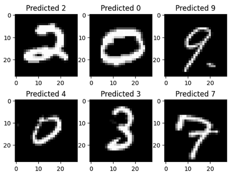
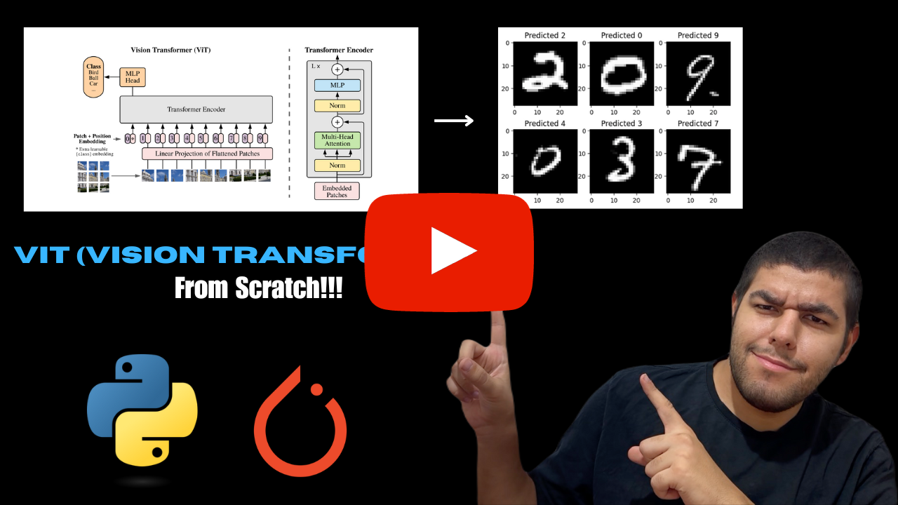

# Transformer Based Punctuation Restoration Models for Turkish

<div align="center">
    <a href="">
        
    </a>
</div>
<br/>
<div align="center">
    <p>Liked our work? give us a ⭐!</p>
</div>



This repository contains minimalistic implementation of ViT (Vision Transformer) that is introduced in the paper (An Image is Worth 16x16 Words: Transformers for Image Recognition at Scale)[https://arxiv.org/abs/2010.11929] using PyTorch. Implementation has tested using Digit Recognizer Competition (MNIST)[https://www.kaggle.com/competitions/digit-recognizer].

Above example demonstrates original images and predicted labels by the ViT model.

### YouTube Tutorial
This repository also contains a corresponding YouTube tutorial with the title **ViT (Vision Transformer) Implement and Train From Scratch || An Image is Worth 16x16 Words**

[](https://www.youtube.com/watch?v=Vonyoz6Yt9c&t=2s)

## Table of Contents
* [Usage](#usage)
* [ViT Implementation](#vitimp)
    * [PatchEmbedding](#embed)
    * [ViT](#vit)
* [Contact](#contact)

## Usage <a class="anchor" id="usage"></a>

I realized it's easier to follow through if the implementation is done via notebook instead of file by file. So this time I did it that way. You can run the code by downloading the notebook and updating the paths of `train` and `test` datasets.

You can also view it directly from https://www.kaggle.com/code/uygarkk/youtube-vit-implementation

Notebook: Implements ViT from scratch, trains it on MNIST dataset, tests it and does inference.

## ViT Implementation <a class="anchor" id="vitimp"></a>
We need two functions to implement ViT. One for processing the image and embeddings until we feed the transformer encoder, and another function for the rest of the process. They're `PatchEmbedding` and `ViT` functions respectively.

### PatchEmbedding <a class="anchor" id="embed">

```
class PatchEmbedding(nn.Module):
    def __init__(self, embed_dim, patch_size, num_patches, dropout, in_channels):
        super().__init__()
        self.patcher = nn.Sequential(
            nn.Conv2d(
                in_channels=in_channels,
                out_channels=embed_dim,
                kernel_size=patch_size,
                stride=patch_size,
            ),
            nn.Flatten(2))

        self.cls_token = nn.Parameter(torch.randn(size=(1, in_channels, embed_dim)), requires_grad=True)
        self.position_embeddings = nn.Parameter(torch.randn(size=(1, num_patches+1, embed_dim)), requires_grad=True)
        self.dropout = nn.Dropout(p=dropout)

    def forward(self, x):
        cls_token = self.cls_token.expand(x.shape[0], -1, -1)

        x = self.patcher(x).permute(0, 2, 1)
        x = torch.cat([cls_token, x], dim=1)
        x = self.position_embeddings + x
        x = self.dropout(x)
        return x

model = PatchEmbedding(EMBED_DIM, PATCH_SIZE, NUM_PATCHES, DROPOUT, IN_CHANNELS).to(device)
x = torch.randn(512, 1, 28, 28).to(device)
print(model(x).shape)
```

### ViT <a class="anchor" id="vit"

```
class ViT(nn.Module):
    def __init__(self, num_patches, img_size, num_classes, patch_size, embed_dim, num_encoders, num_heads, hidden_dim, dropout, activation, in_channels):
        super().__init__()
        self.embeddings_block = PatchEmbedding(embed_dim, patch_size, num_patches, dropout, in_channels)

        encoder_layer = nn.TransformerEncoderLayer(d_model=embed_dim, nhead=num_heads, dropout=dropout, activation=activation, batch_first=True, norm_first=True)
        self.encoder_blocks = nn.TransformerEncoder(encoder_layer, num_layers=num_encoders)

        self.mlp_head = nn.Sequential(
            nn.LayerNorm(normalized_shape=embed_dim),
            nn.Linear(in_features=embed_dim, out_features=num_classes)
        )

    def forward(self, x):
        x = self.embeddings_block(x)
        x = self.encoder_blocks(x)
        x = self.mlp_head(x[:, 0, :])
        return x

model = ViT(NUM_PATCHES, IMG_SIZE, NUM_CLASSES, PATCH_SIZE, EMBED_DIM, NUM_ENCODERS, NUM_HEADS, HIDDEN_DIM, DROPOUT, ACTIVATION, IN_CHANNELS).to(device)
x = torch.randn(512, 1, 28, 28).to(device)
print(model(x).shape)
```

## Contact <a class="anchor" id="contact"></a>
You can contact me with this email address: uygarsci@gmail.com
